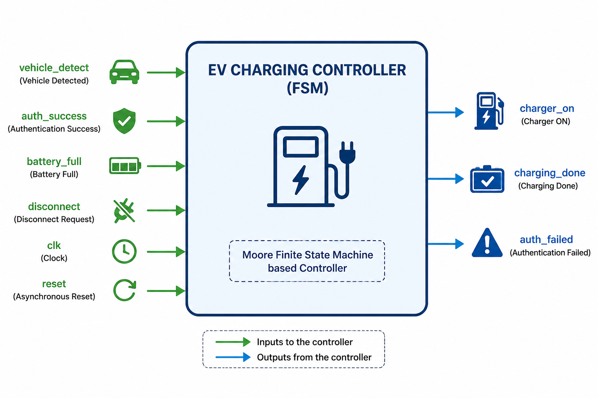
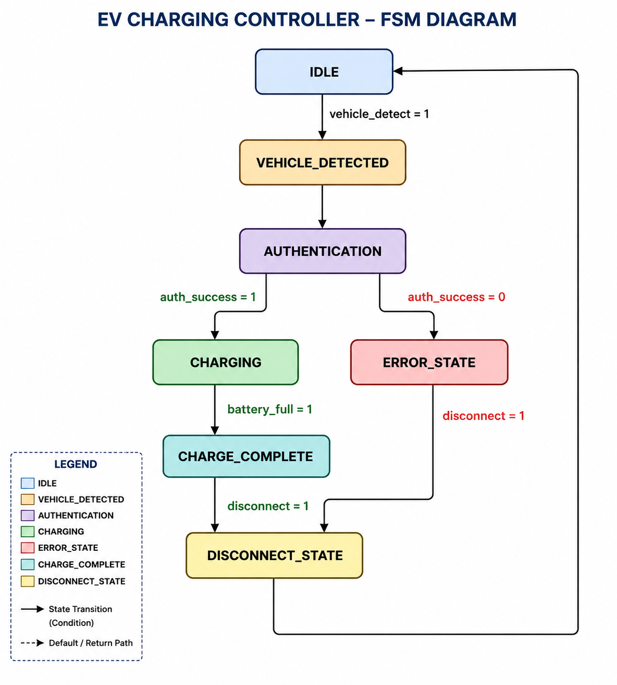
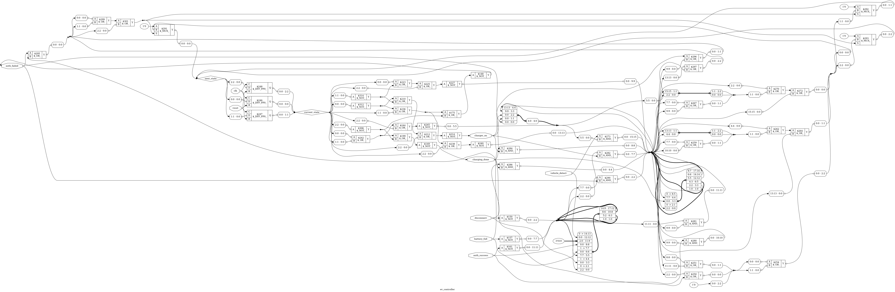

# EV Charging Station Controller using Verilog HDL

An RTL design project that implements an **EV Charging Station Controller** using a **Finite State Machine (FSM)** in Verilog HDL. The controller manages the charging process by monitoring vehicle detection, user authentication, charging status, and battery condition.

The project demonstrates the complete RTL design flow, including design implementation, functional verification, waveform analysis, and RTL synthesis using open-source EDA tools.

---

## Features

- FSM-based EV charging control
- Vehicle detection
- User authentication
- Charging enable and disable control
- Battery full detection
- Charging completion indication
- Error handling
- Synthesizable Verilog RTL design
- Functional verification using a testbench

---

## Tools Used

- Verilog HDL
- Icarus Verilog
- GTKWave
- Yosys
- Ubuntu Linux (WSL)

---

## FSM Design

The controller is implemented using a **Finite State Machine (FSM)** with five states.

| State | Description |
|-------|-------------|
| **IDLE** | Waits for vehicle detection |
| **AUTHENTICATION** | Verifies user authentication |
| **CHARGING** | Enables charging after successful authentication |
| **COMPLETED** | Indicates successful charging completion |
| **ERROR** | Handles authentication failure or invalid conditions |

### State Transition

```text
               +----------------+
               |     IDLE       |
               +----------------+
                       |
              Vehicle Detected
                       |
                       v
          +-------------------------+
          |   AUTHENTICATION        |
          +-------------------------+
            |                   |
 Authentication         Authentication
   Successful              Failed
            |                   |
            v                   v
     +--------------+     +------------+
     |   CHARGING   |     |   ERROR    |
     +--------------+     +------------+
            |
      Battery Full
            |
            v
     +--------------+
     |  COMPLETED   |
     +--------------+
```

---

## Project Structure

```text
EV-Charging-Station-Controller
│
├── LICENSE
├── README.md
├── synth.ys
│
├── rtl
│   └── ev_controller.v
│
├── tb
│   └── ev_controller_tb.v
│
├── sim
│   ├── ev_controller
│   └── ev_controller.vcd
│
├── images
│   ├── block_diagram.png
│   ├── fsm_diagram.png
│   ├── rtl_design_output.png
│   ├── rtl_schematic.png
│   └── waveform.png
│
└── docs
    ├── EV CHARGING STATION CONTROLLER USING VERILOG HDL.docx
    └── EV_Charging_Controller_Report.pdf
```

---

## How to Run

### Compile

```bash
iverilog -o sim/ev_controller rtl/ev_controller.v tb/ev_controller_tb.v
```

### Run Simulation

```bash
vvp sim/ev_controller
```

### View Waveform

```bash
gtkwave sim/ev_controller.vcd
```

---

## Simulation Results

The functionality of the controller was verified through simulation.

The testbench validates:

- Vehicle detection
- User authentication
- Successful charging sequence
- Battery full detection
- Charging completion
- Authentication failure handling
- Error state transition

---

## Block Diagram

System-level architecture of the EV Charging Station Controller.



---

## FSM Diagram

Finite State Machine implemented in the controller.



---

## Simulation Waveform

Simulation results generated using **GTKWave**.


---

## RTL Schematic

RTL schematic generated using **Yosys** after synthesis.



---

## RTL Design Output

RTL design visualization generated after synthesis.


---

## RTL Synthesis

The design is synthesized using **Yosys**.

Run the synthesis script:

```bash
yosys synth.ys
```

The synthesis process converts the Verilog RTL design into an RTL netlist and provides synthesis statistics for the implemented hardware.

---

## Learning Outcomes

Through this project, the following concepts were explored:

- RTL Design using Verilog HDL
- Finite State Machine (FSM) implementation
- Sequential logic design
- Functional verification using testbenches
- Waveform analysis with GTKWave
- RTL synthesis using Yosys
- Open-source VLSI design flow

---

## Applications

- Electric Vehicle Charging Stations
- Smart Charging Infrastructure
- Industrial Automation
- Digital Control Systems
- FPGA and ASIC Design Projects

---

## Documentation

The complete project report is available in the **docs/** directory.

- **EV_Charging_Controller_Report.pdf**
- **EV CHARGING STATION CONTROLLER USING VERILOG HDL.docx**

---

## Author

**Monita Ciea Salins**

Electronics and Communication Engineering  
Mangalore Institute of Technology and Engineering (MITE)

GitHub: https://github.com/Monita-Ciea

---

## License

This project is licensed under the **MIT License**. See the **LICENSE** file for more information.
