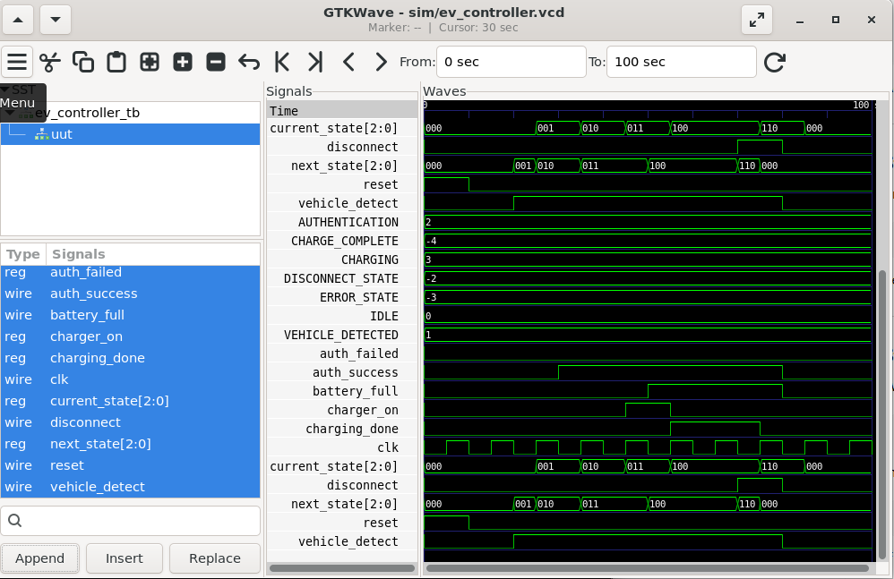
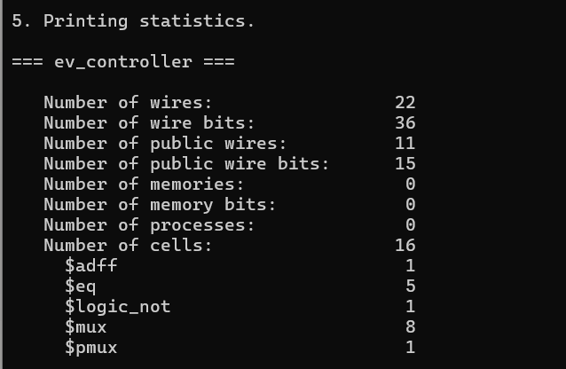

# EV Charging Station Controller using Verilog HDL

## Overview

This project implements an **EV Charging Station Controller** using **Verilog HDL** based on a **Finite State Machine (FSM)** architecture.

The controller is designed to manage the charging process of an electric vehicle by monitoring vehicle detection, user authentication, battery status, and charging conditions. The project demonstrates **RTL design, FSM implementation, functional simulation, and synthesis flow** using open-source EDA tools.

---

## Tools Used

- **Verilog HDL** - RTL Design
- **Icarus Verilog** - Simulation
- **GTKWave** - Waveform Analysis
- **Yosys** - RTL Synthesis
- **Ubuntu Linux (WSL)** - Development Environment

---

## Design

The EV Charging Station Controller is implemented using a **Finite State Machine (FSM)** with five states.

### FSM States

### 1. IDLE
- Initial state of the controller.
- Waits for vehicle detection.

### 2. AUTHENTICATION
- Verifies user authentication before starting charging.

### 3. CHARGING
- Enables charging when authentication is successful and all conditions are satisfied.

### 4. COMPLETED
- Indicates successful completion of the charging process.

### 5. ERROR
- Handles authentication failure or invalid operating conditions.

### State Transition Flow

```
IDLE
  |
  v
AUTHENTICATION
  |
  | Authentication Successful
  v
CHARGING
  |
  | Battery Full
  v
COMPLETED


Authentication Failed
          |
          v
        ERROR
```

---

## Project Structure

```
EV-Charging-Station-Controller
│
├── rtl
│   └── ev_controller.v          # RTL design
│
├── tb
│   └── ev_controller_tb.v       # Testbench
│
├── sim
│   ├── ev_controller            # Simulation executable
│   └── ev_controller.vcd        # Waveform output
│
├── images
│   ├── block_diagram.png
│   ├── fsm_diagram.png
│   ├── rtl_schematic.png
│   └── waveform.png
│
├── docs
│   ├── EV_Charging_Controller_Report.pdf
│   └── EV_Charging_Controller_Report.docx
│
├── synth.ys
├── README.md
└── LICENSE

```

---

## How to Run

### Compile RTL and Testbench

```bash
iverilog -o sim/ev_controller rtl/ev_controller.v tb/ev_controller_tb.v
```

### Run Simulation

```bash
vvp sim/ev_controller
```

### View Waveform

```bash
gtkwave sim/ev_controller.vcd
```

---

## Simulation Results

The simulation verifies the functionality of the EV Charging Controller.

The following operations are successfully tested:

- Vehicle detection
- User authentication
- Authentication success condition
- Authentication failure handling
- Charging activation
- Battery full detection
- Charging completion
- Error state operation

---

## Waveform

Simulation waveform generated using GTKWave:



---

## RTL Design

RTL design output generated after synthesis:



---

## Synthesis

The RTL design is synthesized using **Yosys**.

Synthesis script:

```
synth.ys
```

The synthesis flow converts the Verilog RTL design into a gate-level representation and provides information about the implemented hardware structure.

---

## Learning Outcomes

- Designed an FSM-based digital control system
- Implemented sequential logic using Verilog HDL
- Developed RTL design and verification environment
- Performed simulation using Icarus Verilog
- Analyzed timing behavior using GTKWave
- Understood RTL synthesis flow using Yosys
- Gained practical experience in VLSI design methodology

---

## Applications

- Electric Vehicle charging systems
- Smart charging stations
- Digital control systems
- FSM-based automation controllers
- RTL design and verification learning platforms

---

## 👩‍💻 Author

**Monita Ciea Salins**

Electronics and Communication Engineering  
Mangalore Institute of Technology and Engineering (MITE)

GitHub: https://github.com/Monita-Ciea

---

## License

This project is licensed under the MIT License.
